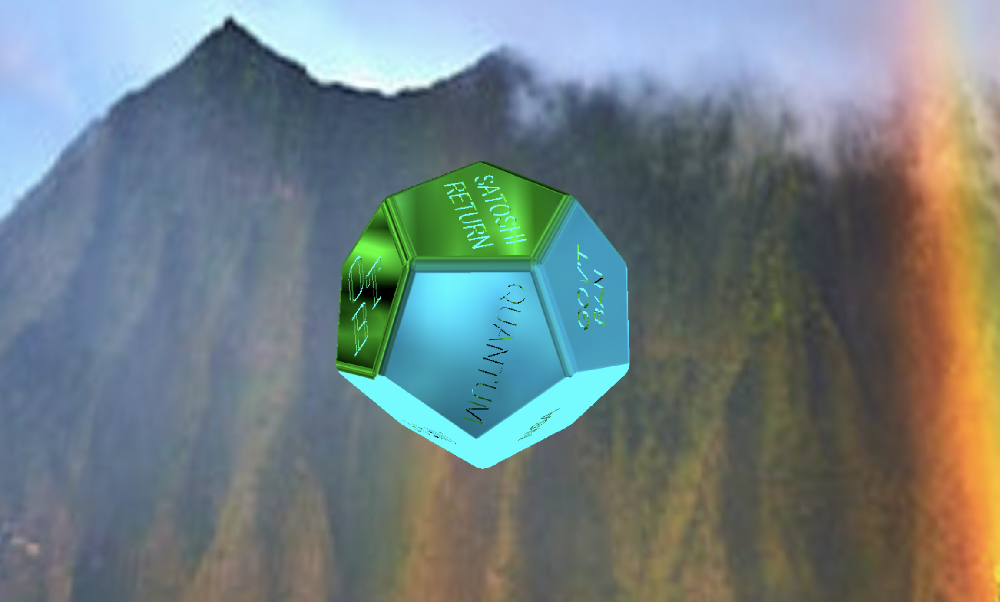

# Digital Trinket Docs

## Potential Trinket Colors



### Quickstart
I have decided that since I was already using Git for the trinket development,
I should point people in the community to it since it's open source by default.
I enjoy doing lots of small silly commits so forgive me.

## Dependencies
I personally run the following setup, Windows 10 with WSL 2 (Ubuntu 20.04).
Use the following tutorial to mirror my setup:
https://www.omgubuntu.co.uk/how-to-install-wsl2-on-windows-10

* You also need node.js and npm which you can get with:
```
sudo apt update
```
```
sudo apt install nodejs npm
```

I use the 'servez' command (you can use any software to run the local server)
in my bash shell at the root of the project directory to run a local server at
localhost:8080. Install the servez package found here:
https://greggman.github.io/servez/
* clone this repo
```
git clone https://github.com/gregman/servez.git
```
* change to the project's folder
```
cd servez
```
* checkout master branch
```
git checkout master
```
* install dependencies
```
npm install
```
* Install three.js
```
npm install three
```

## Running the Code
* Clone the project
```
git clone https://github.com/iturner72/iturner3js
```
* Change to the project's root directory
```
cd iturner3js
```
* Start the local server
```
servez
```
You should now be able to view the Trinket at localhost:8080 in your browser.


