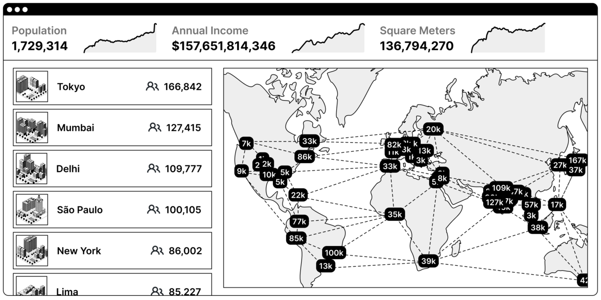

## Digital Trinket Docs

### Quickstart
I have decided that since I was already using Git for the trinket development,
I should point people in the community to it since it's open source by default.
I enjoy doing lots of small silly commits so forgive me.

I will provide 2 different methods for running the three.js. The only
editing you will need to do would be to download the model files and images. In
the first case (with more flexibility I think...) you will need to install some
software, in the second case I will attempt to make a Repl so it's ez pz.

My hope is that some people make modifications or personalizations to their
trinket (on the condition that it's cool with Matt and Nic). Otherwise, if all
200 members are to get the same trinket, then we can have more than one mind on
the animation. I think it's close to completion, with the exception of the
updated FUDs and the Brink Nation Logo.

I feel that there are far more creative people than me on gm. This is why I
will strive to make it easy for anyone to boot up and make edits. I can't wait
to see what we come up with.

## Network State Parallel
I am obsessed with the Network State idea so I couldn't help but think of a
parallel with this trinket. If Matt and Nic give the greenlight for 200 unique
trinkets, then it's almost as if we are members in the Network State with our
respective backgrounds. There would be quite a bit of geographical diversity
if enough people decided to change their backgrounds (I can change it for you
if you can't get it working), which is just the coolest thought to me and
reminds me of the GIF in Balaji's book. Of course the backgrounds don't have to
dox you, but if you currently reside in a city with an awesome skyline or
landscape and you feel comfortable sharing, it would really be something cool.
A digital represantation of a physical geographic decentralization.

